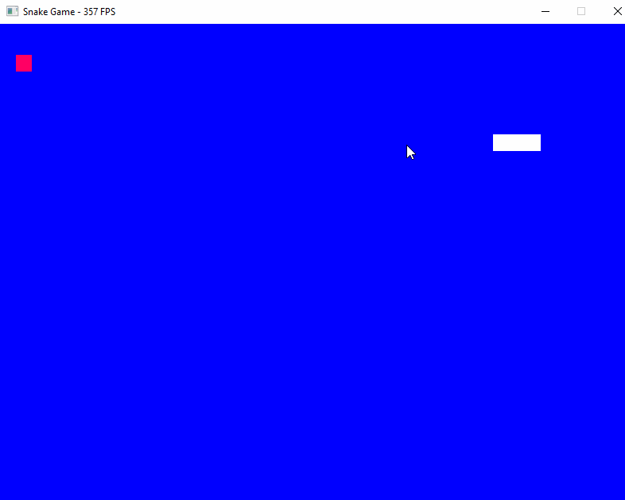
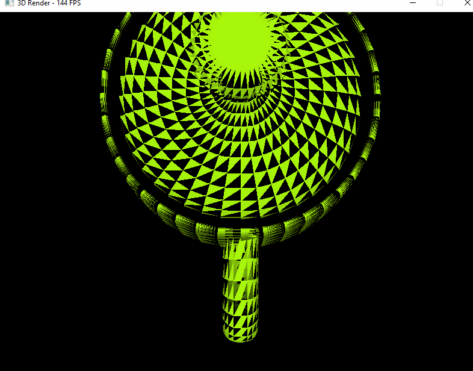

# graphics
Some crappy code while I try to learn the bare minimum about computer graphics.

Currently supported:
- Simple vector/matrix mathematics
- PNG image imports (in progress).
- Extraction of PNG Sprites
- Drawing strings (using PNG sprites)

Example image:
```
cargo run --example rotatingpng --release
```
Produces:
<br>


[Image source here.](https://en.wikipedia.org/wiki/Portable_Network_Graphics#/media/File:PNG_transparency_demonstration_1.png)
<br>
```
cargo run --example snake --release
```
Produces:
<br>

<br>
```
cargo run --example test3d --release
```
Produces:
<br>


Use arrow keys to control  X and Y viewpoint coordinates. And WASD keys to control perspective.

<br>
Some helpful links for research:
     <a href="https://iq.opengenus.org/bresenhams-circle-drawing-algorithm"> Circle Drawing </a>
     <a href="https://stackoverflow.com/questions/1201200/fast-algorithm-for-drawing-filled-circles"> Filled Circle </a>
     <a href="https://github.com/OneLoneCoder/olcPixelGameEngine/blob/master/olcPixelGameEngine.h">  (Javidx9  github) </a>
